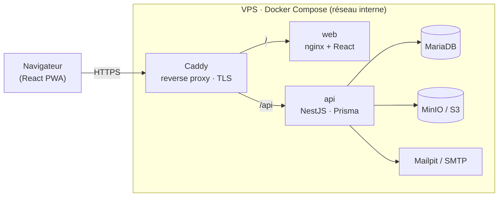
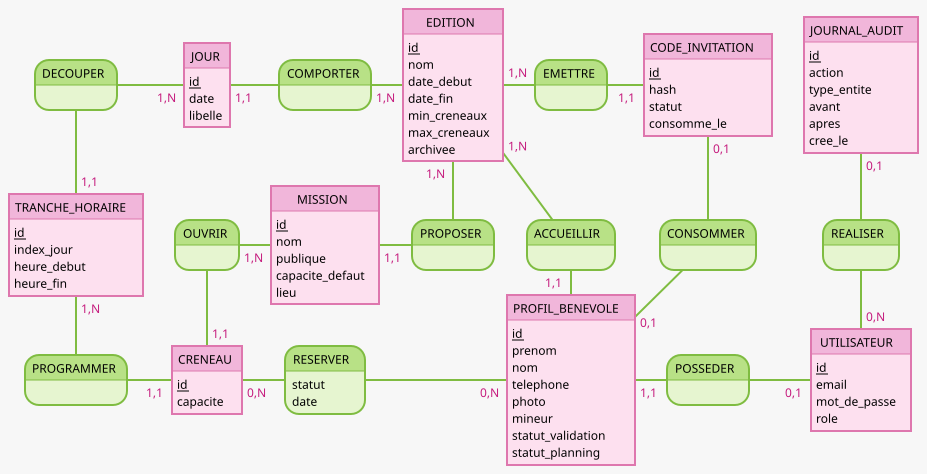

<div align="center">

# 💃 Salon de la Danse — Plateforme de gestion des bénévoles

**Application web sur-mesure pour la coordination des ~130 bénévoles du Salon de la Danse d'Angers (édition 2027).**

Inscription par code d'invitation · composition de planning mobile-first avec règles métier · back-office d'administration · badges PDF avec QR de vérification.

<sub>Monorepo `api/` (NestJS) + `web/` (React) · déploiement Docker + CI/CD</sub>

</div>

---

## ✨ Fonctionnalités

### Espace bénévole
- 🔑 **Inscription par code d'invitation** (usage unique, haché en base) puis composition du planning
- 📸 **Photo obligatoire** (verrou d'accès) — validée et recadrée côté serveur pour le badge
- 📅 **Planning interactif mobile-first** : jour → tranche horaire → missions, jauges & code couleur
- ✅ **Validation définitive** verrouillante, récapitulatif imprimable + export agenda (iCal)
- 🔒 **Mot de passe oublié** en self-service (lien signé valable 1 h)

### Back-office administrateur
- 📊 **Tableau de bord temps réel** : remplissage par jour/mission, créneaux en sous-effectif
- 🔎 **Recherche multi-critères** + fiche bénévole avec actions d'override (valider, déverrouiller, réinitialiser)
- 🎛️ **CRUD des créneaux** (jauges paramétrables), **gestion des codes** (génération en lot + export)
- 🗓️ **Multi-éditions** : création, archivage en lecture seule, sélecteur d'édition
- 🎫 **Badges PDF + QR signé** (à l'unité ou en planche A4) + **page de vérification publique**
- 📤 **Exports Excel / CSV**, ✉️ **e-mails** (confirmation, rappels J-3), 🧾 **journal d'audit**

---

## 🧱 Stack technique

| Couche | Technologies |
|---|---|
| **Front** | React 19 · TypeScript · Vite · Tailwind CSS · TanStack Query · React Router |
| **API** | NestJS 11 · TypeScript · Prisma |
| **Base de données** | MariaDB 11 (InnoDB, transactions) |
| **Fichiers** | MinIO (S3) · `sharp` (recadrage/validation) |
| **E-mails** | nodemailer · Mailpit (dev) / SMTP (prod) |
| **Documents** | pdfkit · qrcode · exceljs |
| **Auth** | argon2 · JWT en cookie HttpOnly |
| **Infra** | Docker Compose · Caddy (reverse proxy + HTTPS auto) · nginx |
| **CI/CD** | GitHub Actions → build + tests → SSH → `docker compose up` |

---

## 🗺️ Architecture



Un seul point d'entrée (**Caddy**) route le trafic entre le front statique (`/`) et l'API (`/api`). Chaque brique est un conteneur isolé ; seuls les ports **80/443** sont exposés.

---

## 🚀 Démarrage rapide (Docker)

```bash
cp .env.example .env
docker compose up -d --build
docker compose exec api npx prisma db seed   # données de démo
```

| Service | URL locale |
|---|---|
| Application | https://localhost |
| API (santé) | https://localhost/api/health |
| Swagger | https://localhost/api/docs |
| Mailpit (mails de test) | http://localhost:8025 |
| MinIO (console) | http://localhost:9001 |
| Adminer (BDD) | http://localhost:8080 |

> Les **codes d'invitation** et **comptes admin** de démo s'affichent dans les logs du seed.
> Comptes de démo : admin `admin@salon-danse.fr` / `Admin2027!` · bénévoles `…@example.com` / `Benevole2027!`

### Développement sans Docker (itération rapide)

```bash
# Terminal 1 — API
cd api && npm install && npx prisma generate && npm run start:dev

# Terminal 2 — Front
cd web && npm install && npm run dev
```

Le front proxifie `/api` vers `http://localhost:3000`.

---

## ⚙️ Configuration (`.env`)

| Variable | Rôle |
|---|---|
| `DOMAIN` | domaine servi par Caddy (`localhost`, un vrai domaine, ou `:80` pour du HTTP) |
| `DB_NAME` · `DB_USER` · `DB_PASSWORD` · `DB_ROOT_PASSWORD` | base MariaDB |
| `JWT_SECRET` | signature des jetons d'authentification |
| `QR_SIGNING_SECRET` | signature des QR de badge (anti-falsification) |
| `MINIO_ROOT_USER` · `MINIO_ROOT_PASSWORD` | stockage des photos |
| `SMTP_*` · `MAIL_FROM` | e-mails réels (sinon Mailpit en dev) |

> Le fichier `.env` n'est **jamais** committé (voir `.gitignore`). Voir `.env.example`.

---

## 🔄 Déploiement (CI/CD)

1. **Sur le VPS**, une fois :
   ```bash
   git clone <repo> salon2danse && cd salon2danse
   cp .env.example .env       # renseigner DOMAIN, mots de passe, secrets
   docker compose up -d --build
   docker compose exec api npx prisma db seed
   ```
2. **Secrets GitHub** (Settings → Secrets → Actions) : `VPS_HOST`, `VPS_USER`, `VPS_SSH_KEY`, `APP_DIR`.
3. Chaque `push` sur `main` → **build + tests** (GitHub Actions) → **déploiement SSH** automatique.

Le schéma est appliqué au démarrage du conteneur `api` (`prisma db push`).

---

## 📁 Structure du projet

```
salon2danse/
├── api/                    # NestJS
│   ├── prisma/schema.prisma   # 10 tables + contraintes
│   ├── prisma/seed.ts         # données de démo
│   └── src/
│       ├── auth/              # code d'invitation, inscription, JWT, mot de passe oublié
│       ├── planning/          # disponibilités, réservation, règles métier (+ tests)
│       ├── photos/            # upload MinIO (sharp)
│       ├── badges/            # PDF + QR signé + vérification
│       ├── admin/             # dashboard, recherche, créneaux, éditions, exports, audit
│       └── mail/              # nodemailer
├── web/                    # React + Vite
│   └── src/
│       ├── pages/            # login, register, dashboard, planning, recap…
│       ├── admin/            # espace administrateur
│       └── components/       # UI partagée (Select, AppShell…)
├── docker-compose.yml
├── Caddyfile
└── .github/workflows/deploy.yml
```

---

## 🧠 Règles métier (côté serveur, testées)

- Min **1** / max **3** créneaux sur le week-end
- Pas 2 missions sur le même créneau → **contrainte SQL** `UNIQUE(volunteer, timeSlot)`
- Pas 3 créneaux **consécutifs** (pause obligatoire)
- **Jauge** protégée par verrou transactionnel `SELECT … FOR UPDATE`
- Fenêtre d'inscription (dates + verrou / archivage d'édition)
- Missions sensibles (billetterie, caisse) hors planning public

Le module de règles est couvert par des **tests unitaires** (`npm test` dans `api/`), rejoués par la CI.

---

## 🔐 Sécurité

- Mots de passe **argon2**, JWT en cookie **HttpOnly** (anti-XSS)
- Codes d'invitation **hachés**, consommés en **transaction** (anti double-compte)
- Upload photo **ré-encodé** (un faux `.jpg` échoue), stocké hors webroot
- **RBAC** par guards NestJS sur chaque endpoint admin
- QR de badge **signé (HMAC)** — non falsifiable
- Messages **anti-énumération** (login, mot de passe oublié)

---

## 🗃️ Modèle de données

10 tables : `Edition`, `InvitationCode`, `User`, `VolunteerProfile`, `Mission`, `Day`, `TimeSlot`, `MissionSlot`, `Booking`, `AuditLog`.

**MCD (Merise)**



> `CRENEAU` = `MissionSlot` (mission × tranche, avec capacité) · `RESERVATION` = `Booking`.

---

## ✅ État d'avancement

**MVP** — Auth + code + photo · planning + règles + anti-surbooking · validation + récap · back-office + exports ✔️
**Avancé** — Badges PDF + QR · e-mails · mot de passe oublié · audit · multi-éditions ✔️
**À venir** — durcissement HTTPS/CSP, upload du mandat parental pour les mineurs.

---

<div align="center"><sub>Salon de la Danse d'Angers · Édition 2027 · Plateforme de coordination des bénévoles</sub></div>
